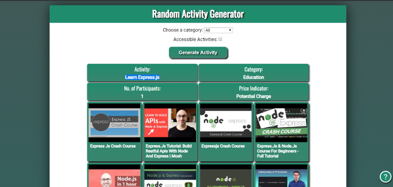
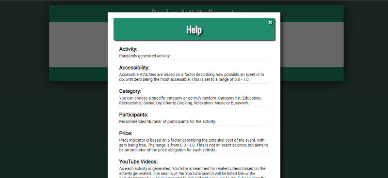

# Random Activity Generator

You have time on your hands, but zero plans. Whether alone or with company, attempting to figure out what to do with your day is almost as difficult as trying to decide on what to eat. 

The Random Activity Generator helps try to make it less difficult and fun. With simplicity in mind, you have two options available, choose a specific category and limit the results to "Accessible" activities. With the activity follows YouTube videos related to the activity generated.  

## Screenshots
Welcome Screen:

Generated Activity:

Help Screen:

## Built with
* HTML
* CSS
* JavaScript
* jQuery
* RESTful APIs

### Features:
- Category Selection
- Accessible Activity option
- Activity Details
	- Price Indicator
	- Recommended No. of Participants
	- Category Name
- Related YouTube Videos

## Demo

- [Live Demo](https://davidjbradleyii.github.io/random-activity-generator-app/)
